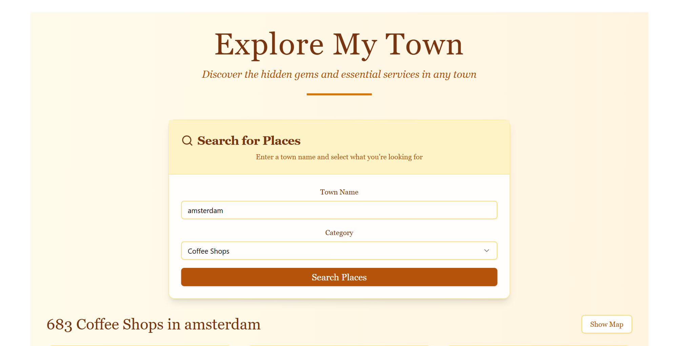

# 🏘️ Explore My Town

> **Discover the hidden gems and essential services in any town** ✨




🔗 **Live Demo:** [explore-my-town.vercel.app](https://explore-my-town.vercel.app/)


A beautiful, vintage-styled web application that helps you find cafés, restaurants, bars, and other amenities in any town around the world. Built with modern technologies and a classic design aesthetic.

   

## 🌟 Features

- 🔍 **Smart Search**: Find places by town name and category
- 🗺️ **Interactive Maps**: Beautiful Leaflet maps with custom vintage markers
- 📱 **Responsive Design**: Works perfectly on desktop and mobile
- 🎨 **Classic Styling**: Vintage-inspired design with serif fonts and warm colors
- ⚡ **Fast & Reliable**: Built with FastAPI backend and React frontend
- 🌍 **Global Coverage**: Uses OpenStreetMap data for worldwide coverage

### 📍 Available Categories
- ☕ Cafés
- 🍽️ Restaurants  
- 🍺 Bars & Pubs
- ✂️ Barbers & Hairdressers
- ☕ Coffee Shops
- 🎬 Cinemas & Theatres
- 🚻 Public Toilets
- 🥖 Bakeries
- 💊 Pharmacies
- 🌳 Parks & Gardens

## 📁 Project Structure

```
explore-my-town/
├── 📂 backend/                 # FastAPI Backend
│   ├── 📂 app/
│   │   ├── 🐍 __init__.py
│   │   └── 🐍 main.py         # Main API endpoints
│   ├── 📄 pyproject.toml      # Python dependencies
│   └── 📄 poetry.lock
│
├── 📂 frontend/                # React Frontend
│   ├── 📂 public/
│   ├── 📂 src/
│   │   ├── 📂 components/
│   │   │   ├── 📂 ui/          # shadcn/ui components
│   │   │   └── 🗺️ SmartMap.tsx # Interactive map component
│   │   ├── 🎨 App.css         # Vintage styling
│   │   ├── ⚛️ App.tsx          # Main React component
│   │   └── 🔧 main.tsx
│   ├── 📄 package.json        # Node.js dependencies
│   ├── 📄 tailwind.config.js  # Tailwind CSS config
│   ├── 📄 vite.config.ts      # Vite build config
│   └── 🔐 .env               # Environment variables
│
├── 📄 README.md               # This file
└── 📄 LICENSE                 # MIT License
```

## 🚀 Quick Start

### Prerequisites

Make sure you have these installed:
- 🐍 **Python 3.8+** ([Download here](https://python.org))
- 📦 **Node.js 16+** ([Download here](https://nodejs.org))
- 📝 **Poetry** ([Install guide](https://python-poetry.org/docs/#installation))

### 🏃‍♂️ Running Locally

#### 1️⃣ Clone the Repository
```bash
git clone https://github.com/raimonvibe/explore-my-town.git
cd explore-my-town
```

#### 2️⃣ Setup Backend (FastAPI)
```bash
# Navigate to backend directory
cd backend

# Install dependencies with Poetry
poetry install

# Start the development server
poetry run fastapi dev app/main.py
```

The backend will be running at: **http://localhost:8000** 🎯

#### 3️⃣ Setup Frontend (React)
Open a **new terminal** and run:
```bash
# Navigate to frontend directory
cd frontend

# Install dependencies
npm install

# Start the development server
npm run dev
```

The frontend will be running at: **http://localhost:5173** 🌐

#### 4️⃣ Start Exploring! 🎉
1. Open your browser to **http://localhost:5173**
2. Enter a town name (e.g., "Paris", "London", "New York")
3. Select a category (e.g., "Cafés")
4. Click "Search Places"
5. Click "Show Map" to see results on an interactive map!

## 🌐 Deployment

### 🚀 Deploy to Vercel (Recommended)

#### Frontend Deployment
1. **Fork this repository** to your GitHub account
2. **Sign up** at [vercel.com](https://vercel.com) with your GitHub account
3. **Import your project**:
   - Click "New Project"
   - Select your forked repository
   - Set **Root Directory** to `frontend`
   - Set **Framework Preset** to "Vite"
4. **Add Environment Variable**:
   - In project settings, add: `VITE_API_URL=https://your-backend-url.com`
5. **Deploy** 🚀

#### Backend Deployment Options

**Option 1: Railway** (Easiest)
1. Sign up at [railway.app](https://railway.app)
2. Connect your GitHub repository
3. Select the `backend` folder
4. Railway will auto-detect FastAPI and deploy!

**Option 2: Render**
1. Sign up at [render.com](https://render.com)
2. Create a new "Web Service"
3. Connect your repository
4. Set **Root Directory** to `backend`
5. Set **Build Command** to `poetry install`
6. Set **Start Command** to `poetry run fastapi run app/main.py --host 0.0.0.0 --port $PORT`

**Option 3: Heroku**
1. Install [Heroku CLI](https://devcenter.heroku.com/articles/heroku-cli)
2. Create a `Procfile` in the backend directory:
   ```
   web: poetry run fastapi run app/main.py --host 0.0.0.0 --port $PORT
   ```
3. Deploy:
   ```bash
   cd backend
   heroku create your-app-name
   git subtree push --prefix backend heroku main
   ```

### 🔧 Environment Variables

**Frontend (.env)**
```env
VITE_API_URL=http://localhost:8000  # For local development
# VITE_API_URL=https://your-backend-url.com  # For production
```

## 🛠️ Development

### 🧪 API Endpoints

The backend provides these endpoints:

- `GET /healthz` - Health check
- `GET /api/categories` - Get all available categories
- `GET /api/places?town={town}&category={category}` - Search for places

### 🎨 Styling

The app uses a vintage design system:
- **Colors**: Warm amber tones (#92400e, #fbbf24, #fef3c7)
- **Fonts**: Georgia serif for headings, system fonts for body
- **Components**: shadcn/ui with custom vintage styling

### 🗺️ Map Features

- **Interactive Markers**: Custom vintage-styled markers for each category
- **Auto-fitting Bounds**: Map automatically zooms to show all results
- **Rich Popups**: Click markers to see detailed place information
- **Responsive Design**: Works on all screen sizes

## 🤝 Contributing

We welcome contributions! Here's how to get started:

1. **Fork** the repository
2. **Create** a feature branch: `git checkout -b feature/amazing-feature`
3. **Commit** your changes: `git commit -m 'Add amazing feature'`
4. **Push** to the branch: `git push origin feature/amazing-feature`
5. **Open** a Pull Request

### 🐛 Found a Bug?

Please [open an issue](https://github.com/raimonvibe/explore-my-town/issues) with:
- Description of the bug
- Steps to reproduce
- Expected vs actual behavior
- Screenshots (if applicable)

## 📚 Tech Stack

### Backend
- **FastAPI** - Modern, fast web framework for Python
- **httpx** - Async HTTP client for API requests
- **Poetry** - Dependency management

### Frontend  
- **React 18** - UI library
- **TypeScript** - Type safety
- **Vite** - Build tool and dev server
- **Tailwind CSS** - Utility-first CSS framework
- **shadcn/ui** - Beautiful UI components
- **Leaflet** - Interactive maps
- **Lucide React** - Beautiful icons

### Data Sources
- **OpenStreetMap** - Global map data
- **Nominatim** - Geocoding service
- **Overpass API** - Query OpenStreetMap data

## 📄 License

This project is licensed under the MIT License - see the [LICENSE](LICENSE) file for details.

## 🙏 Acknowledgments

- **OpenStreetMap** contributors for the amazing map data
- **shadcn** for the beautiful UI components
- **Leaflet** team for the excellent mapping library
- **FastAPI** team for the incredible web framework

## 📞 Support

Need help? Here are your options:

- 📖 **Documentation**: Check this README first
- 🐛 **Bug Reports**: [Open an issue](https://github.com/raimonvibe/explore-my-town/issues)
- 💬 **Discussions**: [GitHub Discussions](https://github.com/raimonvibe/explore-my-town/discussions)
- 📧 **Email**: Contact the maintainer

---

<div align="center">

**Made with ❤️ by [@raimonvibe](https://github.com/raimonvibe)**

⭐ **Star this repo if you found it helpful!** ⭐

</div>
